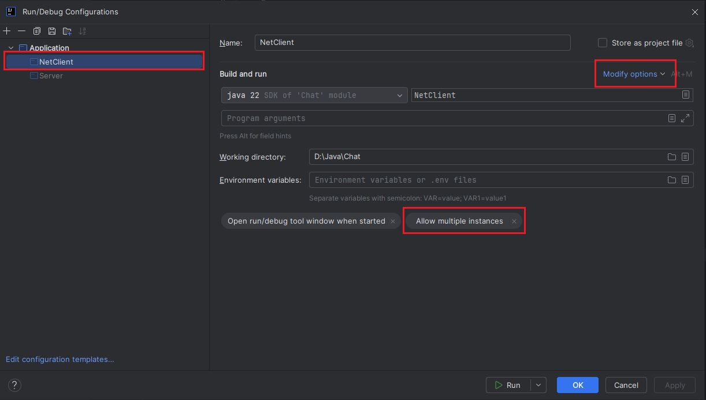

## Самый простой чат-сервер.

Для работы с программой можно использовать PuTTY или запускать программу с помощью отдельного класса NetClient.

Для запуска программы с помощью отдельного класса NetClient, 
в **Intellij IDEA** передите в ***Edit Configurations*** -> 
***Modify options*** и выберите  ***Allow multiple instances***

